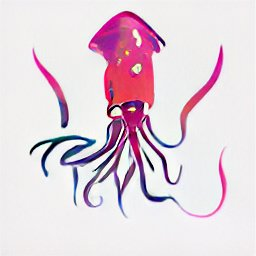

<p align="center">
    <br>
    
    <br>
</p>

<div align="center">

# SquidInk
SquidInk is an image/video augmentation library powered by JAX <br>
</div>

<br><br>

## Features
- GPU/TPU accelerated jittable augmentations.
- Apply random augmentations to batch efficiently by `jax.vmap`.
- Differentiable.

## Installation

Please install jax and jaxlib by yourself before installing squidink (See https://github.com/google/jax#installation). <br>
After install jax and jaxlib, you can install squidink via pip:

```bash
pip install git+https://github.com/h-terao/squidink
```

## Usage
All augmentation expects the given array to have a shape of [..., H, W, C] and normalized in the range of [0, 1].

```python
import jax.numpy as jnp
import squidink.functional as F

x = jnp.zeros((32, 32, 3))  # define an 32x32 image.
F.center_crop(x, crop_size=16).shape
# => [16, 16, 3]
F.center_crop(jnp.zeros((8, 32, 32, 3)), crop_size=16).shape
# => [8, 16, 16, 3]
```

Some operations require PRNG key to apply the stochastic transformations.
```python
import jax.random as jr
rng = jr.PRNGKey(0)
F.random_crop(rng, jnp.zeros((8, 32, 32, 3)), crop_size=16).shape
# => [8, 16, 16, 3]
```

Note that the above example applies the same transformation (i.e., crop from the same position.) to eight images. To apply the different transformation to each image, use `jax.vmap` or `jax.pmap`.
```python
import jax
jax.vmap(jr.split(rng, 8), jnp.zeros((8, 32, 32, 3)), crop_size=16).shape
# => [8, 16, 16, 3]
```

To accelerate augmentations, wrap functions by `jax.jit`.
```python
import functools
crop_fun = jax.jit(functools.partial(F.random_crop, crop_size=16))
crop_fun(jr.split(rng, 8), jnp.zeros((8, 32, 32, 3))).shape
# => [8, 16, 16, 3]
```


<br>

<footer>
Logo is generated by <a target="_blank" href="https://huggingface.co/spaces/dalle-mini/dalle-mini">DALL-E mini</a>. (prompt: logo of a colorful squid)
</footer>